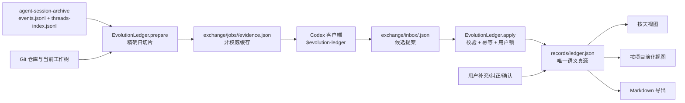

# Work Evolution V0 Implementation Plan

> **For agentic workers:** This plan can be executed manually with `subagent-driven-development` or `executing-plans` when the user explicitly chooses one. Steps use checkbox (`- [ ]`) syntax for tracking.

**Goal:** 在 TimeLedger Mac App 中建立一个可回看、可核实、可补充的“工作沉淀”系统：既能按天看到当天全部 Codex 工作与价值，也能按项目还原长期演化；Codex 客户端只生成候选，App 保存用户确认后的正式记录。

**Architecture:** 使用一个深模块 `EvolutionLedger` 统一四件事：准备证据、导入候选、读取投影、应用用户操作。`agent-session-archive` 与 Git 工作树是原始证据，`~/Documents/Personal Evolution/records/ledger.json` 是唯一语义真源；按天页、按项目页和 Markdown 都只是同一份数据的投影。Codex 通过显式 `$evolution-ledger` Skill 写入单向 inbox，TimeLedger 校验后导入为候选，Mac App 不调用 AI，也不依赖 iPhone 连接。

**Tech Stack:** Swift 5.9、Swift Package Manager、SwiftUI（macOS 14）、Foundation/CryptoKit、XCTest、`agent-session-archive` Python CLI、Git CLI、JSON/JSONL。

## Global Constraints

- TimeLedger 主实施分支固定为 `feature/work-evolution-v0`；该分支已建立。
- 当前工作树已有用户的 iOS 未提交修改与 `build/`，执行者不得修改、暂存或提交这些既有文件。
- V0 只改 `Packages/EvolutionCore`、`EvolutionHub`、本方案列出的文档/测试；不改 iOS SwiftData schema、iOS model、手机 `SyncBatch` 或镜像协议。
- Mac App 启动后默认进入“工作沉淀”，不要求先连接 iPhone。
- Mac App 不调用 Codex、OpenAI API 或其他模型；AI 处理只由用户在 Codex 客户端显式执行。
- 所有当天有实际消息的 Codex 会话都必须归口：项目、跨项目、独立思考、待归类、排除、处理任务；不得静默遗漏。
- “当天来源 N 个”必须满足：当天消息时间窗内的 distinct thread 数 = 页面列表数 = 可点击会话数 = coverage 总数。
- 跨天会话按消息 `created_at` 切日，不能用线程 `updated_at`、CollectorResult 的 `messagesImported` 或整段 ContextEvent 代替。
- 项目身份跟随长期目标；桌面 App、CLI、轻架构等实现方式属于 `ProjectRoute`，不是自动拆成新项目。
- 项目状态分三组保存：进展状态、结束方式、产物状态；不得用一个 `status` 混合表达。
- 价值分项目价值、过程价值、跨项目价值，并标记已实现、待验证、未形成；V0 不做分数。
- 后来认识必须同时保存 `happenedAt` 与 `recognizedAt`：按项目投影回原节点，按天投影出现在认识发生日。
- 会话说法必须用实际仓库/工作树核实；commit、dirty worktree、测试结果是不同证据，不得把“有 commit”写成“功能已验证”。
- 当前工作树不能证明过去未提交内容；历史回填必须明确标记该证据限制。
- 用户补充、用户纠正、已确认日期、已确认项目和已确认节点属于用户锁定内容，后续候选不得覆盖。
- 原始会话不复制进正式 ledger；完整正文仍从 `agent-session-archive` 的 canonical `events.jsonl` 读取。`exchange/jobs` 中的证据 bundle 是可删除缓存，不是真源。
- 正式语义真源固定为单文件 `records/ledger.json`；V0 不引入数据库、SwiftData、SQLite、图数据库、向量库或后台调度器。
- Markdown 只导出，不反向写入；用户补充和确认只在 App 中写回 JSON 真源。
- 统一时区为 `Asia/Taipei`，自然日为 `[00:00, 次日 00:00)`。
- 历史回填以“结果是否满足验收”为完成条件，不使用“真实运行几天”作为门槛。
- `$evolution-ledger` 正式源属于独立仓库 `agent-skill-governance`；Git 无法用 TimeLedger 的一个分支承载两个仓库，因此 Skill 适配器必须作为本方案最后一个独立变更集执行，不能伪装成 TimeLedger 分支内文件。
- 不自动 commit、push、rebase、改系统配置；每个任务的 commit 步骤只在执行者获准提交时运行，`scripts/apply` 必须在执行时再次取得用户对系统配置变更的确认。

---

## 已核实的现状与设计依据

- `Packages/EvolutionCore/Sources/EvolutionCore/SourceAdapters.swift:41-49` 已读取 `source_file/source_line`，但 `118-137` 构造 `ContextMessage` 时丢失了它们。
- 同一适配器在 `83-90` 只筛“当天活跃线程”，之后会导入该线程全部历史消息，不能直接作为日切片。
- `NaturalDayWindow.contains(_:)`（`Packages/EvolutionCore/Sources/EvolutionCore/NaturalDayWindow.swift:21-23`）可作为唯一消息日界线判断。
- `GitEvidenceAdapter.recentCommits(since:limit:)`（`Packages/EvolutionCore/Sources/EvolutionCore/GitEvidenceAdapter.swift:11-23`）只读 commit，不含 branch/HEAD/staged/unstaged/untracked。
- `HubStore`（`EvolutionHub/Sources/EvolutionHubCore/Store/HubStore.swift:5-345`）目前基本全内存，重启会丢；不能继续把新语义数据堆进这个数组集合。
- `RootView` 当前默认 `.connection`（`EvolutionHub/Sources/EvolutionHub/RootView.swift:11`），但 context/review 页面已经与 iPhone mirror 解耦。
- `DailyReviewHubView` 的 `HSplitView`（`EvolutionHub/Sources/EvolutionHub/DailyReviewHubView.swift:8-71`）和 `InboxView` 的 list-selection-detail 模式可复用。
- `SyncBatch` 是手机设备交换协议；AI 候选不能复用 `SyncBatchImporter.applyToStore` 的直接 upsert 权限。
- `agent-session-archive/tools/collector_cli.py` 的 `active_events` 只按活跃 thread 过滤，没有再次按事件时间过滤；历史回填也不能把 `--since` 当严格覆盖保证。

## 唯一数据流



## 文件结构锁定

### TimeLedger 仓库

- Create `Packages/EvolutionCore/Sources/EvolutionCore/WorkEvolutionDomain.swift`：项目、路线、日切片、决策、教训、价值、演化节点、用户补充。
- Create `Packages/EvolutionCore/Sources/EvolutionCore/WorkEvolutionEvidence.swift`：会话、消息引用、来源覆盖、工作树证据、准备请求与证据 bundle。
- Create `Packages/EvolutionCore/Sources/EvolutionCore/EvolutionProposal.swift`：候选 envelope、诊断、导入 receipt。
- Create `Packages/EvolutionCore/Sources/EvolutionCore/EvolutionLedgerLayout.swift`：共享目录布局。
- Create `Packages/EvolutionCore/Sources/EvolutionCore/ArchiveEvidenceReader.swift`：canonical JSONL 读取、精确日切片、全文读取与引用校验。
- Create `Packages/EvolutionCore/Sources/EvolutionCore/WorktreeEvidenceAdapter.swift`：只读 Git/工作树快照。
- Create `Packages/EvolutionCore/Sources/EvolutionCore/EvolutionFileStore.swift`：`ledger.json` 原子读写。
- Create `Packages/EvolutionCore/Sources/EvolutionCore/EvolutionLedger.swift`：深模块唯一入口。
- Create `Packages/EvolutionCore/Sources/EvolutionCore/EvolutionProposalValidator.swift`：结构、coverage、引用、幂等与用户锁校验。
- Create `Packages/EvolutionCore/Sources/EvolutionCore/EvolutionMarkdownExporter.swift`：只读导出。
- Modify `Packages/EvolutionCore/Package.swift`：增加 `EvolutionLedgerCLI` executable target/product。
- Create `Packages/EvolutionCore/Sources/EvolutionLedgerCLI/main.swift`：`prepare` 与 `validate` 两个确定性命令。
- Create focused XCTest files under `Packages/EvolutionCore/Tests/EvolutionCoreTests/` matching the source names above.
- Create `EvolutionHub/Sources/EvolutionHubCore/Store/WorkEvolutionHubStore.swift`：Observable façade，不复制领域规则。
- Create `EvolutionHub/Sources/EvolutionHubCore/Import/EvolutionProposalInbox.swift`：扫描 inbox、调用 ledger、写 receipt、移动 processed。
- Modify `EvolutionHub/Sources/EvolutionHub/EvolutionHubApp.swift`：注入 WorkEvolutionHubStore，并在启动/激活时刷新。
- Modify `EvolutionHub/Sources/EvolutionHub/RootView.swift`：唯一入口“工作沉淀”，默认选中。
- Create `EvolutionHub/Sources/EvolutionHub/WorkEvolution/WorkEvolutionView.swift`：按天/按项目切换与三栏 shell。
- Create `EvolutionHub/Sources/EvolutionHub/WorkEvolution/WorkEvolutionDayView.swift`：日价值地图。
- Create `EvolutionHub/Sources/EvolutionHub/WorkEvolution/WorkEvolutionProjectView.swift`：项目演化地图。
- Create `EvolutionHub/Sources/EvolutionHub/WorkEvolution/SourceConversationInspector.swift`：当天片段/完整会话。
- Create `EvolutionHub/Sources/EvolutionHub/WorkEvolution/UserAnnotationComposer.swift`：补充、纠正、后来认识。
- Create focused tests under `EvolutionHub/Tests/EvolutionHubCoreTests/` for store, inbox and reload behavior.

### 运行数据（不进入 Git）

```text
~/Documents/Personal Evolution/
├── records/
│   └── ledger.json
├── exchange/
│   ├── inbox/
│   ├── processed/
│   └── jobs/
└── exports/
    ├── Daily Maps/
    └── Project Evolutions/
```

### Skill 治理仓库（独立变更集）

- Create `agent-skill-governance/skills/evolution-ledger/SKILL.md`。
- Create `agent-skill-governance/skills/evolution-ledger/agents/openai.yaml`。
- Modify `agent-skill-governance/policy.yaml`：加入 `manual` 与 `protected`。

## 稳定身份规则

同一事实在重跑时必须得到同一 ID；禁止使用随机 UUID 生成 proposal 内容。固定规则如下（hash 取 `ContentHasher.hashParts` 前 12 位）：

```text
SourceSessionRecord.id = <source>:<externalThreadId>
DailySessionSlice.id = day-source:<date>:<SourceSessionRecord.id>
MessageReference.id = message:<hash(source, thread, event, source_file, source_line, contentHash)>
EvolutionProject.id = 优先复用 ledger 已有项目 ID；全新长期目标用 project:<hash(normalizedGoal)>，normalize 在 ID helper 内部统一执行 trim、空白折叠与 lowercase
ProjectRoute.id = 优先复用已有 route；新 route 用 route:<projectId>:<hash(name, sortedRepoPaths)>
ProjectDaySlice.id = slice:<date>:<projectId>
DecisionRecord.id = decision:<ProjectDaySlice.id>:<hash(decision, reason)>
LearningRecord.id = learning:<ProjectDaySlice.id>:<hash(observation, lesson)>
ValueRecord.id = value:<ProjectDaySlice.id>:<kind>:<hash(title, detail)>
IndependentThought.id = thought:<date>:<hash(title, body)>
EvolutionNode.id = 优先复用同项目/同 kind/同 happenedAt 的已有节点；新节点用 node:<projectId>:<kind>:<hash(happenedAt, title)>
WorktreeEvidenceSnapshot.id = worktree:<hash(repoPath, branch, head, verificationStatus, limitation, sortedChanges, sortedChecks, sortedCommits)>
UserAnnotation.id = 只由 App 创建 UUID；Proposal 不得生成
EvolutionProposalEnvelope.sourceDigest = hash(sourceCutoffAt, sorted day IDs, sorted source-slice IDs, sorted message IDs)，只能调用共享 `EvolutionSourceDigest`
```

这些规则的目标是重跑不重复，不是让 hash 代替语义判断。项目/路线/节点已有 ID 时必须复用，不能因文案润色创建第二个对象。

---

### Task 1: 锁定 Work Evolution 领域契约与共享目录

**Files:**
- Create: `Packages/EvolutionCore/Sources/EvolutionCore/WorkEvolutionDomain.swift`
- Create: `Packages/EvolutionCore/Sources/EvolutionCore/WorkEvolutionEvidence.swift`
- Create: `Packages/EvolutionCore/Sources/EvolutionCore/EvolutionProposal.swift`
- Create: `Packages/EvolutionCore/Sources/EvolutionCore/EvolutionLedgerLayout.swift`
- Test: `Packages/EvolutionCore/Tests/EvolutionCoreTests/WorkEvolutionCodingTests.swift`
- Test: `Packages/EvolutionCore/Tests/EvolutionCoreTests/EvolutionLedgerLayoutTests.swift`

**Interfaces:**
- Consumes: `ContextSource`, `ContextMessageRole`, `FactLevel`, `EvolutionSchema.current`, `ISO8601Codec`, `ContentHasher`。
- Produces: `EvolutionProject`, `ProjectRoute`, `WorkEvolutionDayRecord`, `ProjectDaySlice`, `EvolutionNode`, `UserAnnotation`, `SourceSessionRecord`, `DailySessionSlice`, `MessageReference`, `SourceCoverage`, `WorktreeEvidenceSnapshot`, `EvolutionProposalEnvelope`, `ImportReceipt`, `EvolutionLedgerDocument`, `EvolutionLedgerLayout`。

- [ ] **Step 1: 写 Codable round-trip 失败测试**

在 `WorkEvolutionCodingTests.swift` 写出一个包含以下完整关系的 fixture，并用 `ISO8601Codec.encoder/decoder` round-trip：

```swift
func testLedgerDocumentRoundTripPreservesTwoAxesAndUserContent() throws {
    let goal = "用最低复杂度管理 Agent Skills"
    let projectId = EvolutionStableID.newProject(normalizedGoal: goal)
    let routeId = EvolutionStableID.route(projectId: projectId, name: "轻量 CLI", repoPaths: ["/tmp/skill-manager"])
    let sliceId = EvolutionStableID.projectDaySlice(date: "2026-07-17", projectId: projectId)
    let project = EvolutionProject(
        id: projectId,
        name: "Skill Manager",
        goal: goal,
        aliases: ["Skill Manager App"],
        routes: [ProjectRoute(id: routeId, name: "轻量 CLI", summary: "替代桌面 App", repoPaths: ["/tmp/skill-manager"], startedAt: date("2026-07-16T08:00:00Z"), endedAt: nil, status: .active, reviewState: .candidate)],
        progressStatus: .active,
        endMode: nil,
        artifactStatus: .pendingValidation,
        reviewState: .candidate,
        createdAt: date("2026-07-16T08:00:00Z"),
        updatedAt: date("2026-07-17T08:00:00Z")
    )
    let day = WorkEvolutionDayRecord(
        date: "2026-07-17",
        sourceCutoffAt: date("2026-07-17T15:00:00Z"),
        projectSlices: [ProjectDaySlice(id: sliceId, date: "2026-07-17", projectId: project.id, routeIds: [routeId], purpose: "验证轻架构", actions: ["缩小架构"], progress: "形成可运行 CLI", factLevel: .verified, decisions: [], learnings: [], values: [], sourceSliceIds: [], evidenceIds: [], reviewState: .candidate)],
        independentThoughts: [],
        sourceSlices: [],
        coverage: SourceCoverage(expectedSessionCount: 0, includedSessionIds: [], pendingSessionIds: [], excludedSessionIds: [], processorSessionIds: []),
        reviewState: .candidate,
        generatedAt: date("2026-07-17T15:01:00Z"),
        updatedAt: date("2026-07-17T15:01:00Z")
    )
    let note = UserAnnotation(id: "11111111-1111-1111-1111-111111111111", target: AnnotationTarget(kind: .day, targetId: day.date), kind: .supplement, body: "真正价值是降低维护成本", happenedAt: nil, recognizedAt: date("2026-07-17T16:00:00Z"), createdAt: date("2026-07-17T16:00:00Z"), updatedAt: date("2026-07-17T16:00:00Z"))
    let original = EvolutionLedgerDocument(projects: [project], days: [day], nodes: [], annotations: [note], sourceSessions: [], worktreeEvidence: [], imports: [], updatedAt: date("2026-07-17T16:00:00Z"))

    let data = try ISO8601Codec.encoder.encode(original)
    let decoded = try ISO8601Codec.decoder.decode(EvolutionLedgerDocument.self, from: data)

    XCTAssertEqual(decoded.projects.single?.goal, "用最低复杂度管理 Agent Skills")
    XCTAssertEqual(decoded.days.single?.projectSlices.single?.projectId, project.id)
    XCTAssertEqual(decoded.annotations.single?.body, "真正价值是降低维护成本")
}
```

测试文件内增加私有 `date(_:)` 与 `Array.single` helper；不得依赖生产代码的测试专用 API。

- [ ] **Step 2: 运行测试确认缺少类型而失败**

Run:

```bash
cd /Users/lessen/coding/test/TimeLedger/Packages/EvolutionCore
swift test --filter WorkEvolutionCodingTests
```

Expected: FAIL，编译错误包含 `cannot find 'EvolutionProject' in scope`。

- [ ] **Step 3: 实现精确领域类型**

所有 public DTO 使用 `Codable, Sendable, Hashable`，有稳定 ID 的类型再加 `Identifiable`，并提供 public initializer。枚举值固定如下，不得另造同义词：

```swift
public enum ReviewState: String, Codable, Sendable, Hashable { case candidate, confirmed }
public enum ProjectProgressStatus: String, Codable, Sendable, Hashable { case exploring, active, paused, ended }
public enum ProjectEndMode: String, Codable, Sendable, Hashable { case completed, abandoned, replaced }
public enum ArtifactStatus: String, Codable, Sendable, Hashable { case notFormed, pendingValidation, verifiedUsable, inUse, stopped }
public enum ProjectRouteStatus: String, Codable, Sendable, Hashable { case active, paused, stopped, replaced }
public enum ValueKind: String, Codable, Sendable, Hashable { case project, process, crossProject }
public enum ValueRealizationStatus: String, Codable, Sendable, Hashable { case realized, pending, notFormed }
public enum LearningKind: String, Codable, Sendable, Hashable { case mistake, failedAssumption, constraint, reusableMethod }
public enum EvolutionNodeKind: String, Codable, Sendable, Hashable { case purpose, decision, pivot, failedRoute, outcome, statusChange, reflection }
public enum EvolutionNodeOrigin: String, Codable, Sendable, Hashable { case user, assistant, joint }
public enum AnnotationTargetKind: String, Codable, Sendable, Hashable { case day, project, projectDaySlice, evolutionNode, sourceSession }
public enum AnnotationKind: String, Codable, Sendable, Hashable { case supplement, correction, reflection }
public enum DailySourceClassification: String, Codable, Sendable, Hashable { case project, crossProject, independentThought, pending, excluded, processor }
public enum EvidenceVerificationStatus: String, Codable, Sendable, Hashable { case verified, partial, unverified, failed }
public enum WorktreeChangeKind: String, Codable, Sendable, Hashable { case staged, unstaged, untracked }
public enum VerificationCheckStatus: String, Codable, Sendable, Hashable { case passed, failed, notRun }
```

`WorkEvolutionDomain.swift` 必须定义这些字段：

```swift
public struct ProjectRoute: Codable, Sendable, Hashable, Identifiable {
    public var id: String
    public var name: String
    public var summary: String
    public var repoPaths: [String]
    public var startedAt: Date
    public var endedAt: Date?
    public var status: ProjectRouteStatus
    public var reviewState: ReviewState
}

public struct EvolutionProject: Codable, Sendable, Hashable, Identifiable {
    public var id: String
    public var name: String
    public var goal: String
    public var aliases: [String]
    public var routes: [ProjectRoute]
    public var progressStatus: ProjectProgressStatus
    public var endMode: ProjectEndMode?
    public var artifactStatus: ArtifactStatus
    public var reviewState: ReviewState
    public var createdAt: Date
    public var updatedAt: Date
}

public struct DecisionRecord: Codable, Sendable, Hashable, Identifiable {
    public var id: String
    public var title: String
    public var decision: String
    public var reason: String
    public var alternatives: [String]
    public var factLevel: FactLevel
    public var evidenceIds: [String]
}

public struct LearningRecord: Codable, Sendable, Hashable, Identifiable {
    public var id: String
    public var kind: LearningKind
    public var observation: String
    public var lesson: String
    public var reusablePrinciple: String?
    public var factLevel: FactLevel
    public var evidenceIds: [String]
}

public struct ValueRecord: Codable, Sendable, Hashable, Identifiable {
    public var id: String
    public var kind: ValueKind
    public var status: ValueRealizationStatus
    public var title: String
    public var detail: String
    public var factLevel: FactLevel
    public var evidenceIds: [String]
}

public struct ProjectDaySlice: Codable, Sendable, Hashable, Identifiable {
    public var id: String
    public var date: String
    public var projectId: String
    public var routeIds: [String]
    public var purpose: String
    public var actions: [String]
    public var progress: String
    public var factLevel: FactLevel
    public var decisions: [DecisionRecord]
    public var learnings: [LearningRecord]
    public var values: [ValueRecord]
    public var sourceSliceIds: [String]
    public var evidenceIds: [String]
    public var reviewState: ReviewState
}

public struct IndependentThought: Codable, Sendable, Hashable, Identifiable {
    public var id: String
    public var date: String
    public var title: String
    public var body: String
    public var factLevel: FactLevel
    public var decisions: [DecisionRecord]
    public var learnings: [LearningRecord]
    public var values: [ValueRecord]
    public var sourceSliceIds: [String]
    public var evidenceIds: [String]
    public var reviewState: ReviewState
}

public struct EvolutionNode: Codable, Sendable, Hashable, Identifiable {
    public var id: String
    public var projectId: String
    public var routeIds: [String]
    public var happenedAt: Date
    public var recognizedAt: Date
    public var kind: EvolutionNodeKind
    public var title: String
    public var detail: String
    public var reason: String
    public var origin: EvolutionNodeOrigin
    public var factLevel: FactLevel
    public var sourceSliceIds: [String]
    public var evidenceIds: [String]
    public var reviewState: ReviewState
}

public struct AnnotationTarget: Codable, Sendable, Hashable {
    public var kind: AnnotationTargetKind
    public var targetId: String
}

public struct UserAnnotation: Codable, Sendable, Hashable, Identifiable {
    public var id: String
    public var target: AnnotationTarget
    public var kind: AnnotationKind
    public var body: String
    public var happenedAt: Date?
    public var recognizedAt: Date
    public var createdAt: Date
    public var updatedAt: Date
}
```

同文件定义稳定 ID 的唯一实现，计划正文和 validator 不再各写一套 hash 逻辑：

```swift
public enum EvolutionStableID {
    public static func sourceSession(source: ContextSource, externalThreadId: String) -> String
    public static func dailySession(date: String, sessionId: String) -> String
    public static func message(source: ContextSource, threadId: String, eventId: String, sourceFile: String, sourceLine: Int, contentHash: String) -> String
    public static func newProject(normalizedGoal: String) -> String
    public static func route(projectId: String, name: String, repoPaths: [String]) -> String
    public static func projectDaySlice(date: String, projectId: String) -> String
    public static func decision(sliceId: String, decision: String, reason: String) -> String
    public static func learning(sliceId: String, observation: String, lesson: String) -> String
    public static func value(sliceId: String, kind: ValueKind, title: String, detail: String) -> String
    public static func independentThought(date: String, title: String, body: String) -> String
    public static func evolutionNode(projectId: String, kind: EvolutionNodeKind, happenedAt: Date, title: String) -> String
    public static func worktreeFileChange(path: String, kind: WorktreeChangeKind, statusCode: String) -> String
    public static func verificationCheck(command: [String]) -> String
    public static func proposalDiagnostic(code: String, message: String, relatedIds: [String]) -> String
    public static func worktree(repoPath: String, branch: String, head: String, verificationStatus: EvidenceVerificationStatus, limitation: String?, sortedChanges: [String], sortedChecks: [String], sortedCommits: [String]) -> String
    public static func worktreeContentHash(repoPath: String, branch: String, head: String, verificationStatus: EvidenceVerificationStatus, limitation: String?, sortedChanges: [String], sortedChecks: [String], sortedCommits: [String]) -> String
}
```

每个函数统一取 `ContentHasher.hashParts` 前 12 位；数组参数先按稳定字符串排序。实体 ID 只包含稳定语义字段：例如 VerificationCheck 由 command 识别，同一检查从 failed 变 passed 仍是同一检查；但 WorktreeEvidenceSnapshot 必须把 branch、验证状态、限制、完整 change/check/commit fingerprints 纳入父快照 ID 与 contentHash，避免不同历史日或不同验证结论碰撞。`capturedAt` 是重跑会变化的审计时间，不进入身份或 contentHash。测试必须同时覆盖顺序不敏感和语义字段变化。

`WorkEvolutionEvidence.swift` 与 `EvolutionProposal.swift` 必须使用以下外部接口；后续任务只能填充行为，不能改名：

```swift
public struct MessageReference: Codable, Sendable, Hashable, Identifiable {
    public var id: String
    public var source: ContextSource
    public var threadId: String
    public var eventId: String
    public var createdAt: Date
    public var role: ContextMessageRole
    public var sourceFile: String
    public var sourceLine: Int
    public var excerpt: String
    public var contentHash: String
}

public struct SourceSessionRecord: Codable, Sendable, Hashable, Identifiable {
    public var id: String
    public var source: ContextSource
    public var externalThreadId: String
    public var title: String
    public var cwd: String?
    public var createdAt: Date
    public var updatedAt: Date
    public var canonicalEventsPath: String
    public var canonicalThreadsPath: String
    public var contentHash: String
}

public struct DailySessionSlice: Codable, Sendable, Hashable, Identifiable {
    public var id: String
    public var date: String
    public var sessionId: String
    public var classification: DailySourceClassification
    public var projectIds: [String]
    public var messageReferences: [MessageReference]
    public var exclusionReason: String?
}

public struct SourceCoverage: Codable, Sendable, Hashable {
    public var expectedSessionCount: Int
    public var includedSessionIds: [String]
    public var pendingSessionIds: [String]
    public var excludedSessionIds: [String]
    public var processorSessionIds: [String]
}

public struct WorkEvolutionDayRecord: Codable, Sendable, Hashable, Identifiable {
    public var id: String { date }
    public var date: String
    public var sourceCutoffAt: Date
    public var projectSlices: [ProjectDaySlice]
    public var independentThoughts: [IndependentThought]
    public var sourceSlices: [DailySessionSlice]
    public var coverage: SourceCoverage
    public var reviewState: ReviewState
    public var generatedAt: Date
    public var updatedAt: Date
}

public struct WorktreeFileChange: Codable, Sendable, Hashable, Identifiable {
    public var id: String
    public var path: String
    public var kind: WorktreeChangeKind
    public var statusCode: String
}

public struct VerificationCheck: Codable, Sendable, Hashable, Identifiable {
    public var id: String
    public var command: [String]
    public var status: VerificationCheckStatus
    public var summary: String
}

public struct WorktreeEvidenceSnapshot: Codable, Sendable, Hashable, Identifiable {
    public var id: String
    public var repoPath: String
    public var branch: String
    public var head: String
    public var capturedAt: Date
    public var relevantCommits: [GitEvidenceSummary]
    public var changes: [WorktreeFileChange]
    public var checks: [VerificationCheck]
    public var verificationStatus: EvidenceVerificationStatus
    public var limitation: String?
    public var contentHash: String
}
```

`EvolutionProposal.swift` 必须定义完整候选与回执契约：

```swift
public enum EvolutionProposalScopeKind: String, Codable, Sendable, Hashable {
    case day
    case history
}

public struct EvolutionProposalScope: Codable, Sendable, Hashable {
    public var kind: EvolutionProposalScopeKind
    public var dates: [String]
}

public enum ProposalDiagnosticSeverity: String, Codable, Sendable, Hashable {
    case info
    case warning
    case error
}

public struct ProposalDiagnostic: Codable, Sendable, Hashable, Identifiable {
    public var id: String
    public var severity: ProposalDiagnosticSeverity
    public var code: String
    public var message: String
    public var relatedIds: [String]
}

public enum ImportReceiptStatus: String, Codable, Sendable, Hashable {
    case imported
    case noOp
    case conflict
    case rejected
}

public struct ImportReceipt: Codable, Sendable, Hashable, Identifiable {
    public var id: String { "\(jobId):\(proposalDigest)" }
    public var jobId: String
    public var proposalDigest: String
    public var status: ImportReceiptStatus
    public var acceptedDayIds: [String]
    public var skippedLockedIds: [String]
    public var warnings: [String]
    public var errors: [String]
    public var importedAt: Date
}

public struct EvolutionProposalEnvelope: Codable, Sendable, Hashable, Identifiable {
    public var id: String { jobId }
    public var schemaVersion: Int
    public var jobId: String
    public var scope: EvolutionProposalScope
    public var createdAt: Date
    public var sourceCutoffAt: Date
    public var sourceDigest: String
    public var sessions: [SourceSessionRecord]
    public var days: [WorkEvolutionDayRecord]
    public var projects: [EvolutionProject]
    public var nodes: [EvolutionNode]
    public var worktreeEvidence: [WorktreeEvidenceSnapshot]
    public var userAnnotations: [UserAnnotation]
    public var diagnostics: [ProposalDiagnostic]
}
```

所有 proposal 中的 `reviewState` 必须是 `.candidate`，且 `userAnnotations` 必须为空；非空时整包拒绝。`ImportReceipt` 可以进正式 ledger 作为幂等索引，但 proposal 自身只在 `exchange/processed` 留档。

`EvolutionLedgerDocument` 的数组是唯一正式存储，不在按天和按项目之间复制对象：

```swift
public struct EvolutionLedgerDocument: Codable, Sendable, Hashable {
    public var schemaVersion: Int
    public var projects: [EvolutionProject]
    public var days: [WorkEvolutionDayRecord]
    public var nodes: [EvolutionNode]
    public var annotations: [UserAnnotation]
    public var sourceSessions: [SourceSessionRecord]
    public var worktreeEvidence: [WorktreeEvidenceSnapshot]
    public var imports: [ImportReceipt]
    public var updatedAt: Date
}
```

其 public initializer 的 `schemaVersion` 参数默认值必须是 `EvolutionSchema.current`；测试和调用方不得每次手写协议版本。

- [ ] **Step 4: 写并实现共享目录测试**

测试断言 `EvolutionLedgerLayout(rootURL:)` 精确产生 `records/ledger.json`、`exchange/inbox`、`exchange/processed`、`exchange/jobs`、两个 exports 目录；`ensureDirectories()` 后全部存在。默认根实现必须是：

```swift
public static func defaultDocuments(fileManager: FileManager = .default) -> EvolutionLedgerLayout {
    let documents = fileManager.urls(for: .documentDirectory, in: .userDomainMask).first
        ?? fileManager.homeDirectoryForCurrentUser.appendingPathComponent("Documents", isDirectory: true)
    return EvolutionLedgerLayout(rootURL: documents.appendingPathComponent("Personal Evolution", isDirectory: true))
}
```

- [ ] **Step 5: 运行 Task 1 测试**

Run: `swift test --filter 'WorkEvolutionCodingTests|EvolutionLedgerLayoutTests'`

Expected: PASS；JSON key 排序由 `ISO8601Codec.encoder` 保证。

- [ ] **Step 6: Commit（仅在获准时）**

```bash
git add Packages/EvolutionCore/Sources/EvolutionCore/WorkEvolutionDomain.swift Packages/EvolutionCore/Sources/EvolutionCore/WorkEvolutionEvidence.swift Packages/EvolutionCore/Sources/EvolutionCore/EvolutionProposal.swift Packages/EvolutionCore/Sources/EvolutionCore/EvolutionLedgerLayout.swift Packages/EvolutionCore/Tests/EvolutionCoreTests/WorkEvolutionCodingTests.swift Packages/EvolutionCore/Tests/EvolutionCoreTests/EvolutionLedgerLayoutTests.swift
git commit -m "feat(evolution): add work evolution contracts"
```

### Task 2: 从 canonical archive 生成精确日切片与可打开全文

**Files:**
- Create: `Packages/EvolutionCore/Sources/EvolutionCore/ArchiveEvidenceReader.swift`
- Test: `Packages/EvolutionCore/Tests/EvolutionCoreTests/ArchiveEvidenceReaderTests.swift`

**Interfaces:**
- Consumes: `NaturalDayWindow`, `MessageReference`, `SourceSessionRecord`, `DailySessionSlice`, `SourceCoverage`。
- Produces:

```swift
public struct SourceArchiveLocation: Codable, Sendable, Hashable {
    public var source: ContextSource
    public var eventsPath: String
    public var threadsPath: String
}

public struct PreparedMessage: Codable, Sendable, Hashable, Identifiable {
    public var id: String { reference.id }
    public var reference: MessageReference
    public var text: String
}

public struct PreparedArchiveDay: Codable, Sendable, Hashable {
    public var date: String
    public var sessions: [SourceSessionRecord]
    public var slices: [DailySessionSlice]
    public var messages: [PreparedMessage]
    public var coverage: SourceCoverage
    public var diagnostics: [ProposalDiagnostic]
    public var sourceDigest: String
}

public struct ArchiveEvidenceReader: Sendable {
    public func prepareDay(location: SourceArchiveLocation, date: Date, cutoffAt: Date, calendar: Calendar, processorThreadIds: Set<String>) throws -> PreparedArchiveDay
    public func conversation(session: SourceSessionRecord) throws -> [PreparedMessage]
    public func contains(_ reference: MessageReference, in session: SourceSessionRecord) throws -> Bool
}
```

- [ ] **Step 1: 写跨天线程和 17 来源测试**

测试 fixture 建一个跨三天的 thread、一个只在当天的 thread，并生成另外 15 个当天 thread。prepare 阶段只做证据准备，因此除 processor 外全部先归 pending。断言：

```swift
XCTAssertEqual(day.slices.count, 17)
XCTAssertEqual(Set(day.slices.map(\.sessionId)).count, 17)
XCTAssertTrue(day.slices.allSatisfy { !$0.messageReferences.isEmpty })
XCTAssertTrue(day.messages.allSatisfy { window.contains($0.reference.createdAt) })
XCTAssertEqual(reader.conversation(session: spanningSession).count, 3)
XCTAssertEqual(spanningDaySlice.messageReferences.count, 1)
XCTAssertEqual(spanningDaySlice.messageReferences.single?.sourceLine, 22)
```

再增加 processor 测试：第一条 user 消息以 `$evolution-ledger` 或 `[$evolution-ledger]` 开头时，该 session 分类为 `.processor`；它仍在 17 个来源中，但进入 `processorSessionIds`，不进入 `includedSessionIds`。增加 cutoff 测试：同日 cutoff 之后的消息不进入当天 slice，留给下一次作业。

- [ ] **Step 2: 运行测试确认失败**

Run: `swift test --filter ArchiveEvidenceReaderTests`

Expected: FAIL，缺少 `ArchiveEvidenceReader`。

- [ ] **Step 3: 实现 JSONL 行模型与严格时间窗**

实现 private `ArchiveEventRow` / `ArchiveThreadRow`，用 `CodingKeys` 映射 snake_case。算法顺序固定：

1. 读所有 event 行并解析 `created_at`，同时支持 `Z` 与显式 `+08:00`。
2. 仅保留 `window.contains(createdAt) && createdAt <= cutoffAt` 的消息。
3. 从过滤后消息反推 distinct thread IDs。
4. threads index 只补元数据，不参与当天计数。
5. 每个 session 生成一个 `DailySessionSlice`，按“稳定身份规则”生成 ID，初始为 `.pending`；processor detector 命中则为 `.processor`。
6. `MessageReference.excerpt` 保存正文前 160 个字符；`id` 使用 `ContentHasher.hashParts([source.rawValue, threadId, eventId, sourceFile, String(sourceLine), contentHash])`。
7. 单个 `PreparedArchiveDay.sourceDigest` 对 cutoff 与排序后的 `reference.id` 计算 hash；不得对文件 mtime 计算。Proposal/EvidenceBundle 的总 source digest 必须统一调用公开 `EvolutionSourceDigest`，覆盖 cutoff、day IDs、source-slice IDs 与 message IDs，禁止各自产生第二套算法。
8. `conversation` 读取同一 canonical events 文件，按 thread ID 过滤全部消息并按 `createdAt/sourceLine` 排序。
9. 缺失原 `source_file/source_line` 时保留 canonical message，分别写空路径与 `-1`，并增加 warning diagnostic；不能静默丢 session。

`SourceCoverage` 初始值必须满足：

```swift
let processor = slices.filter { $0.classification == .processor }.map(\.sessionId)
let pending = slices.filter { $0.classification == .pending }.map(\.sessionId)
return SourceCoverage(
    expectedSessionCount: slices.count,
    includedSessionIds: [],
    pendingSessionIds: pending.sorted(),
    excludedSessionIds: [],
    processorSessionIds: processor.sorted()
)
```

- [ ] **Step 4: 增加重复文本保真诊断测试**

同一 thread 两天完全相同文本在 archive 只出现一次时，reader 不伪造第二条；`PreparedArchiveDay` 只反映现有 canonical 证据。测试名称 `testDoesNotInventCollapsedDuplicateMessage`，断言目标日为 0 个 slice，并在后续 proposal diagnostics 允许记录 `archive fidelity limitation`。

同一测试文件再覆盖：thread.updated_at 在当天但没有当天 event 时计数为 0；UTC 与 UTC+8 混合时间落入正确自然日；缺失原文件/原行号时 session 保留且 diagnostics 非空。

- [ ] **Step 5: 运行 Task 2 测试**

Run: `swift test --filter ArchiveEvidenceReaderTests`

Expected: PASS，17/17 数量一致，跨天全文 3 条、当天片段 1 条。

- [ ] **Step 6: Commit（仅在获准时）**

```bash
git add Packages/EvolutionCore/Sources/EvolutionCore/ArchiveEvidenceReader.swift Packages/EvolutionCore/Tests/EvolutionCoreTests/ArchiveEvidenceReaderTests.swift
git commit -m "feat(evolution): slice archive evidence by message day"
```

### Task 3: 用实际 Git 工作树核实项目状态

**Files:**
- Create: `Packages/EvolutionCore/Sources/EvolutionCore/WorktreeEvidenceAdapter.swift`
- Test: `Packages/EvolutionCore/Tests/EvolutionCoreTests/WorktreeEvidenceAdapterTests.swift`

**Interfaces:**
- Consumes: `WorktreeEvidenceSnapshot`, `WorktreeFileChange`, `VerificationCheck`。
- Produces:

```swift
public enum WorktreeEvidenceError: Error, LocalizedError, Sendable {
    case commandFailed(arguments: [String], status: Int32, stderr: String)
    case notRepository(String)
}

public struct WorktreeEvidenceAdapter: Sendable {
    public init(gitPath: String = "/usr/bin/git")
    public func repositoryRoot(for path: String) throws -> String
    public func snapshot(repoPath: String, since: Date, capturedAt: Date = Date(), historicalDate: Date? = nil, checks: [VerificationCheck] = []) throws -> WorktreeEvidenceSnapshot
}
```

- [ ] **Step 1: 写 dirty worktree 失败测试**

测试在 temp directory 建 Git 仓库，配置局部测试 identity，提交 `tracked.txt`，随后制造 staged、unstaged、untracked 三类变化。断言：

```swift
XCTAssertEqual(snapshot.branch, "main")
XCTAssertEqual(snapshot.head.count, 40)
XCTAssertEqual(Set(snapshot.changes.map(\.kind)), [.staged, .unstaged, .untracked])
XCTAssertEqual(snapshot.verificationStatus, .verified)
XCTAssertNil(snapshot.limitation)
```

dirty 只表示存在未提交证据，不得把 `verificationStatus` 降为失败。

- [ ] **Step 2: 运行测试确认失败**

Run: `swift test --filter WorktreeEvidenceAdapterTests`

Expected: FAIL，缺少 adapter。

- [ ] **Step 3: 实现只读 git 命令与退出码检查**

必须用 `Process` 参数数组执行：

```text
git -C <path> rev-parse --show-toplevel
git -C <root> branch --show-current
git -C <root> rev-parse HEAD
git -C <root> status --porcelain=v1 --untracked-files=all
git -C <root> log --since=<ISO8601> --pretty=format:%H%x09%s%x09%aI --shortstat
```

解析规则：`??` → `.untracked`；index 列非空 → `.staged`；worktree 列非空 → `.unstaged`；同一文件可产生 staged 与 unstaged 两条记录。任何命令非 0 必须抛 `commandFailed`，不能返回空字符串假装干净。

`id/contentHash` 必须由 repo root、branch、HEAD、verificationStatus、limitation、排序后的 changes/checks/commits 共同计算；checks 每项包含 command/status/summary，changes 每项包含 path/kind/statusCode，commits 使用完整稳定 fingerprint。`capturedAt` 不参与身份，避免重跑同一事实产生重复对象。不保存 full diff。

`relevantCommits` 使用现有 `GitEvidenceSummary` 表达，并纳入 contentHash。commit 证明历史提交存在，changes 只证明 capturedAt 时的当前工作树；两者不得混写。

- [ ] **Step 4: 写历史限制测试**

为 `snapshot` 增加可选 `historicalDate` 参数。提供历史日期时，commit 查询必须按 committer date 限定为 Asia/Taipei 当天的完整自然日窗口，输出时间也使用 committer date，不能把次日到当前的提交混入当天。日期早于 capture 日且当前只能检查现状时，固定写：

```text
当前工作树只能核实捕获时状态，无法证明历史未提交内容。
```

并将 `verificationStatus` 设为 `.partial`；commit 历史仍可作为独立证据。

- [ ] **Step 5: 运行 Task 3 测试**

Run: `swift test --filter WorktreeEvidenceAdapterTests`

Expected: PASS；不存在仓库时明确抛 `notRepository`。

- [ ] **Step 6: Commit（仅在获准时）**

```bash
git add Packages/EvolutionCore/Sources/EvolutionCore/WorktreeEvidenceAdapter.swift Packages/EvolutionCore/Tests/EvolutionCoreTests/WorktreeEvidenceAdapterTests.swift
git commit -m "feat(evolution): capture worktree evidence"
```

### Task 4: 建立单文件语义真源与按天/按项目投影

**Files:**
- Create: `Packages/EvolutionCore/Sources/EvolutionCore/EvolutionFileStore.swift`
- Create: `Packages/EvolutionCore/Sources/EvolutionCore/EvolutionLedger.swift`
- Test: `Packages/EvolutionCore/Tests/EvolutionCoreTests/EvolutionLedgerStoreTests.swift`
- Test: `Packages/EvolutionCore/Tests/EvolutionCoreTests/EvolutionProjectionTests.swift`

**Interfaces:**
- Consumes: Task 1 全部领域 DTO、`EvolutionLedgerLayout`。
- Produces:

```swift
public protocol EvolutionDocumentStore: Sendable {
    func load() throws -> EvolutionLedgerDocument
    func save(_ document: EvolutionLedgerDocument) throws
}

public struct JSONEvolutionDocumentStore: EvolutionDocumentStore, Sendable {
    public init(layout: EvolutionLedgerLayout, fileManager: FileManager = .default)
    public func load() throws -> EvolutionLedgerDocument
    public func save(_ document: EvolutionLedgerDocument) throws
}

public enum EvolutionQuery: Sendable, Hashable {
    case all
    case day(String)
    case project(String)
}

public struct EvolutionSnapshot: Sendable, Hashable {
    public var projects: [EvolutionProject]
    public var days: [WorkEvolutionDayRecord]
    public var nodes: [EvolutionNode]
    public var annotations: [UserAnnotation]
    public var sourceSessions: [SourceSessionRecord]
    public var worktreeEvidence: [WorktreeEvidenceSnapshot]
}

public enum EvolutionUserCommand: Sendable, Hashable {
    case addAnnotation(UserAnnotation)
    case confirmDay(String)
    case confirmProject(String)
    case confirmNode(String)
}

public final class EvolutionLedger: @unchecked Sendable {
    public init(store: any EvolutionDocumentStore, archiveReader: ArchiveEvidenceReader = ArchiveEvidenceReader(), worktreeAdapter: WorktreeEvidenceAdapter = WorktreeEvidenceAdapter())
    public func read(_ query: EvolutionQuery) throws -> EvolutionSnapshot
    public func apply(_ command: EvolutionUserCommand) throws -> EvolutionSnapshot
}
```

- [ ] **Step 1: 写首次启动、重启和原子写测试**

测试要求：文件不存在时 `load()` 返回空 document；`save/load` 保留全部数组；故意给损坏 JSON 时抛 decode error，不覆盖损坏文件、不静默返回空；保存后目录中只留下 `ledger.json`，没有半成品文件。

- [ ] **Step 2: 运行 store 测试确认失败**

Run: `swift test --filter EvolutionLedgerStoreTests`

Expected: FAIL，缺少 store。

- [ ] **Step 3: 实现原子存储**

`save` 必须先 `layout.ensureDirectories()`，再使用：

```swift
let data = try ISO8601Codec.encoder.encode(document)
try data.write(to: layout.ledgerFileURL, options: .atomic)
```

空 document 的 `schemaVersion` 固定 `EvolutionSchema.current`，日期数组按 `date`，节点按 `happenedAt/recognizedAt/id`，项目按 `name/id` 排序后保存，减少无意义 diff。

- [ ] **Step 4: 写双轴投影和后来认识测试**

fixture 中一个 node 的 `happenedAt=2026-06-01`、`recognizedAt=2026-07-17`。断言：

- `.project(projectId)` 返回该 node，并按 happenedAt 放回六月演化序列。
- `.day("2026-07-17")` 返回该 node 作为当天新认识。
- `.day("2026-06-01")` 不把这条后来认识伪装成当时已知事实。
- 项目页同时返回按 date 排序的 ProjectDaySlice。

- [ ] **Step 5: 实现查询与用户命令**

查询规则固定：

```swift
// day
days.filter { $0.date == key }
nodes.filter { dayKey($0.recognizedAt) == key }
annotations.filter { annotationBelongsToDay($0, key: key, document: document) }

// project
projects.filter { $0.id == id }
days.flatMap(\.projectSlices).filter { $0.projectId == id }
nodes.filter { $0.projectId == id }.sorted(by: happenedAtThenRecognizedAt)
annotations.filter { annotationBelongsToProject($0, projectId: id, document: document) }
```

`addAnnotation` 只接受 trim 后非空 body，且 target 必须真实存在；reflection 必须提供 `happenedAt`，其他 kind 可为空。`recognizedAt` 作为当天视图日期，`createdAt/updatedAt` 只作审计。annotation 以 ID 幂等 upsert；`confirmDay/Project` 修改对应 `reviewState/updatedAt`；`confirmNode` 只修改节点 `reviewState`，并更新所属项目与文档的 `updatedAt`，不得改写节点的 `happenedAt/recognizedAt`；找不到目标时抛明确 `EvolutionLedgerError.targetNotFound`。

- [ ] **Step 6: 运行 Task 4 测试**

Run: `swift test --filter 'EvolutionLedgerStoreTests|EvolutionProjectionTests'`

Expected: PASS；重建 `EvolutionLedger` 后用户 annotation 仍存在。

- [ ] **Step 7: Commit（仅在获准时）**

```bash
git add Packages/EvolutionCore/Sources/EvolutionCore/EvolutionFileStore.swift Packages/EvolutionCore/Sources/EvolutionCore/EvolutionLedger.swift Packages/EvolutionCore/Tests/EvolutionCoreTests/EvolutionLedgerStoreTests.swift Packages/EvolutionCore/Tests/EvolutionCoreTests/EvolutionProjectionTests.swift
git commit -m "feat(evolution): persist and project work evolution ledger"
```

### Task 5: 校验并幂等导入 Codex 候选提案

**Files:**
- Create: `Packages/EvolutionCore/Sources/EvolutionCore/EvolutionProposalValidator.swift`
- Modify: `Packages/EvolutionCore/Sources/EvolutionCore/EvolutionLedger.swift`
- Test: `Packages/EvolutionCore/Tests/EvolutionCoreTests/EvolutionProposalValidatorTests.swift`
- Test: `Packages/EvolutionCore/Tests/EvolutionCoreTests/EvolutionProposalApplyTests.swift`

**Interfaces:**
- Consumes: `EvolutionProposalEnvelope`, `ArchiveEvidenceReader`, `EvolutionDocumentStore`。
- Produces:

```swift
public struct EvolutionProposalValidator: Sendable {
    public init(archiveReader: ArchiveEvidenceReader = ArchiveEvidenceReader())
    public func validate(_ proposal: EvolutionProposalEnvelope) throws
}

extension EvolutionLedger {
    public func apply(_ proposal: EvolutionProposalEnvelope, proposalDigest: String) throws -> ImportReceipt
}
```

`EvolutionProposalEnvelope` 必须包含：`schemaVersion`、`jobId`、`scope`、`createdAt`、`sourceCutoffAt`、`sourceDigest`、`sessions`、`days`、`projects`、`nodes`、`worktreeEvidence`、`diagnostics`。`ImportReceipt` 必须包含：`jobId`、`proposalDigest`、`status`、`acceptedDayIds`、`skippedLockedIds`、`warnings`、`errors`、`importedAt`。

- [ ] **Step 1: 写结构校验失败测试**

分别覆盖并断言明确 error case：

1. schemaVersion 不等于 current。
2. coverage `expectedSessionCount=17` 但 union 只有 16。
3. union 中 session ID 重复出现在 included 与 processor。
4. day.sourceSlices 的 distinct session 数与 coverage 不一致。
5. project slice 引用不存在的 session slice、project 或 worktree evidence。
6. included 项目 slice 引用 `.processor/.excluded/.pending` session。
7. message reference 在 canonical events 中不存在或 content hash 不匹配。
8. 同一 jobId 已导入但 digest 不同。
9. proposal 的 `userAnnotations` 非空，或任一 day/project/node 为 `.confirmed`。
10. processor source 被 ProjectDaySlice、IndependentThought 或 EvolutionNode 引用。
11. 历史日期引用的当前 worktree snapshot 标记为 `.verified` 且没有 limitation。
12. proposal.days 与 scope.dates 不相等；day/sourceSlice/projectSlice 的 date 不一致。
13. message.createdAt 不在该 day 的 Asia/Taipei 自然日内，或晚于 proposal/day sourceCutoffAt。
14. DailySessionSlice.sessionId 不存在于 proposal.sessions，或 routeIds 引用不存在的 route。
15. 可由 `EvolutionStableID` 重算的 source session、daily source、message、project-day slice 等 ID 不匹配。
16. Decision/Learning/Value/EvolutionNode 的 sourceSliceIds/evidenceIds 悬空，或 evidenceIds 不是 MessageReference/WorktreeEvidenceSnapshot 的有效 ID。
17. `sourceDigest` 与共享 `EvolutionSourceDigest` 重算结果不一致，或 proposal.sessions 与所有可见 source slices 的 session 集合不相等。
18. owner 的消息 evidence 不属于其声明的 sourceSliceIds；项目节点引用 `.project/.crossProject` source 时，该 source 未声明节点所属项目。
19. `.project` source 必须恰好属于 1 个项目，`.crossProject` 至少 2 个，其余 classification 不得声明 projectIds；projectIds 必须与当天 ProjectDaySlice 的反向引用项目集合精确相等。

另建一个合法 17-source fixture，六类 classification 全部出现；断言 coverage 四个 bucket 的并集、day.sourceSlices 的 distinct session IDs 和 expectedSessionCount 都等于 17。

- [ ] **Step 2: 运行 validator 测试确认失败**

Run: `swift test --filter EvolutionProposalValidatorTests`

Expected: FAIL，缺少 validator。

- [ ] **Step 3: 实现 coverage 和引用不变量**

coverage 的唯一合法集合公式：

```swift
let buckets = [included, pending, excluded, processor]
let flattened = buckets.flatMap { $0 }
guard Set(flattened).count == flattened.count else { throw .duplicateCoverageMembership }
guard flattened.count == expectedSessionCount else { throw .coverageCountMismatch }
guard Set(flattened) == Set(day.sourceSlices.map(\.sessionId)) else { throw .coverageIdentityMismatch }
```

`included` 仅对应 `.project/.crossProject/.independentThought`；processor 必须可见但任何 `ProjectDaySlice.sourceSliceIds` 与 `IndependentThought.sourceSliceIds` 都不能引用它。

所有结构/引用错误拒绝整个 proposal，不产生部分正式写入。

- [ ] **Step 4: 写用户锁与幂等 apply 失败测试**

测试流程：导入 candidate → 用户加 correction → confirm day/project/node → 用同一 proposal 重导 → 用新 job 更新同一天。断言：

```swift
XCTAssertEqual(second.status, .noOp)
XCTAssertEqual(reloaded.annotations.single?.body, "用户纠正")
XCTAssertEqual(reloaded.days.single?.reviewState, .confirmed)
XCTAssertTrue(updateReceipt.skippedLockedIds.contains("2026-07-17"))
XCTAssertEqual(reloaded.days.single?.projectSlices.single?.progress, originalProgress)
```

候选项目/节点可被后续候选按稳定 ID 更新；confirmed 项目/节点不可覆盖。用户 annotation 永远不由 proposal 删除。

- [ ] **Step 5: 实现安全 merge 与 receipt**

固定规则：

- structural validation 先于 load/save。
- `(jobId, proposalDigest)` 已存在 → `.noOp`。
- jobId 已存在但 digest 不同 → `.conflict` receipt，ledger 其他内容不变。
- 新记录一律保持 `.candidate`；proposal 传 `.confirmed` 时 validator 拒绝。
- existing confirmed project 的 name/goal/aliases/status 等 base fields 保留；仍允许按稳定 route ID 追加新的 candidate route。既有 confirmed route 不可覆盖，candidate route 可更新。
- existing confirmed day/node 保留原值并把 ID 记入 `skippedLockedIds`。
- existing `.candidate` 用稳定 ID 替换 generated 内容。
- annotations 不参与 proposal merge。
- worktree evidence 是不可变内容寻址对象；同 ID 不同 contentHash、source session 不可变 archive identity 变化、新项目 ID 与 normalized goal 不一致、或同 goal 拆成多个项目 ID，均在 merge 前返回 `.conflict` 且不写账本。
- 同 ID 同 contentHash 的 worktree evidence 保留已接受字节；confirmed day 的证据依赖不得被后续 proposal 改写。合法 source session 的 title/cwd/updatedAt/contentHash 可随完整会话增长更新，但 source/externalThreadId/canonical paths 不可变。
- save 成功后才返回 `.imported` receipt。

- [ ] **Step 6: 运行 Task 5 测试**

Run: `swift test --filter 'EvolutionProposalValidatorTests|EvolutionProposalApplyTests'`

Expected: PASS；无效引用时 `ledger.json` byte-for-byte 不变。

- [ ] **Step 7: Commit（仅在获准时）**

```bash
git add Packages/EvolutionCore/Sources/EvolutionCore/EvolutionProposalValidator.swift Packages/EvolutionCore/Sources/EvolutionCore/EvolutionLedger.swift Packages/EvolutionCore/Tests/EvolutionCoreTests/EvolutionProposalValidatorTests.swift Packages/EvolutionCore/Tests/EvolutionCoreTests/EvolutionProposalApplyTests.swift
git commit -m "feat(evolution): validate and import proposal candidates"
```

### Task 6: 提供 Codex 可调用的确定性 evidence CLI

**Files:**
- Modify: `Packages/EvolutionCore/Package.swift:10-18`
- Modify: `Packages/EvolutionCore/Sources/EvolutionCore/WorkEvolutionEvidence.swift`
- Modify: `Packages/EvolutionCore/Sources/EvolutionCore/EvolutionLedger.swift`
- Create: `Packages/EvolutionCore/Sources/EvolutionLedgerCLI/main.swift`
- Test: `Packages/EvolutionCore/Tests/EvolutionCoreTests/EvolutionPrepareTests.swift`
- Test fixture: `Packages/EvolutionCore/Tests/EvolutionCoreTests/Fixtures/prepare-request.json`

**Interfaces:**
- Consumes: `ArchiveEvidenceReader`, `WorktreeEvidenceAdapter`。
- Produces:

```swift
public struct EvolutionPrepareRequest: Codable, Sendable, Hashable {
    public var date: String
    public var timeZoneIdentifier: String
    public var cutoffAt: Date
    public var archives: [SourceArchiveLocation]
    public var explicitProcessorThreadIds: [String]
}

public struct EvidenceBundle: Codable, Sendable, Hashable {
    public var schemaVersion: Int
    public var jobId: String
    public var request: EvolutionPrepareRequest
    public var archiveDays: [PreparedArchiveDay]
    public var worktrees: [WorktreeEvidenceSnapshot]
    public var diagnostics: [ProposalDiagnostic]
    public var sourceDigest: String
    public var contentHash: String
}

extension EvolutionLedger {
    public func prepare(jobId: String, request: EvolutionPrepareRequest) throws -> EvidenceBundle
}
```

为保证测试可控且不伪造核实时间，`EvolutionLedger` initializer 可新增兼容默认值的 `now: @Sendable () -> Date = Date.init`；prepare 单次读取真实 clock 作为 worktree `capturedAt`，不得使用消息 `cutoffAt` 冒充捕获时间。

- [ ] **Step 1: 写 prepare 聚合失败测试**

fixture 含两个 archive sources、三个 session，其中两个 cwd 指向同一 Git root，一个无 cwd。断言：当天 sessions 全保留、worktree root 去重为 1、无 cwd 产生 warning diagnostic 而不丢 session、bundle hash 重跑稳定。

- [ ] **Step 2: 运行测试确认失败**

Run: `swift test --filter EvolutionPrepareTests`

Expected: FAIL，`EvolutionLedger` 无 `prepare`。

- [ ] **Step 3: 实现 prepare**

固定行为：

1. 用 `TimeZone(identifier: request.timeZoneIdentifier)`；无效时 throw。
2. 每个 archive 调 `prepareDay`，合并但不跨 source 合并 thread ID。
3. 从当天 SourceSessionRecord 的 cwd 调 `repositoryRoot`，去重后 snapshot；当前日的 `since` 使用自然日起点；历史性按 requested day 与真实 `capturedAt` 在目标时区的自然日比较，历史日期同时传 `historicalDate`，适配器据此把 commit 查询限定为当天 `[start, end)`。
4. 无仓库、无 cwd、历史 worktree 限制写 diagnostics，不删除来源。
5. `sourceDigest` 必须调用 `EvolutionSourceDigest` 的同一公开实现；`contentHash` 再对 request（含 cutoff）、sourceDigest、PreparedArchiveDay 的稳定语义 fingerprint（session cwd/canonical identity、slice classification/projectIds、message facts、coverage）、所有 worktree content hashes 与 diagnostics 排序后计算。Proposal 必须原样携带 bundle.sourceDigest；Task 7 导入 inbox 时还要重算 job bundle contentHash 并对照 sourceDigest，不能只相信 proposal 自报。
6. EvidenceBundle 可含当日消息正文供 Codex 处理，但只能写在 `exchange/jobs`，不得写入 `ledger.json` 或 proposal。

- [ ] **Step 4: 增加 CLI product 与参数解析**

`Package.swift` 增加：

```swift
.executable(name: "evolution-ledger-cli", targets: ["EvolutionLedgerCLI"])
```

以及：

```swift
.executableTarget(name: "EvolutionLedgerCLI", dependencies: ["EvolutionCore"])
```

CLI 只支持两个命令，参数必须逐项校验：

```text
evolution-ledger-cli prepare --job-id <id> --request <request.json> --output <evidence.json>
evolution-ledger-cli validate --proposal <proposal.json>
```

`prepare` 先写 `<output>.tmp`，成功后用 `FileManager.replaceItemAt`/`moveItem` 原子发布；`validate` 只解码与执行结构校验，不写 `records`。失败 exit 1 并把单行错误写 stderr；成功 stdout 分别是：

```json
{"ok":true,"jobId":"...","sessions":17}
{"ok":true,"jobId":"..."}
```

- [ ] **Step 5: 运行 CLI smoke test**

Run:

```bash
cd /Users/lessen/coding/test/TimeLedger/Packages/EvolutionCore
swift run evolution-ledger-cli prepare --job-id test-job --request Tests/EvolutionCoreTests/Fixtures/prepare-request.json --output /tmp/evolution-evidence-test.json
```

Expected: exit 0；stdout 的 `ok=true`；输出可由 `ISO8601Codec.decoder` 解码为 EvidenceBundle。测试 fixture 必须只引用测试临时 fixture，不引用用户真实归档。

- [ ] **Step 6: 运行 EvolutionCore 全量测试**

Run: `swift test`

Expected: PASS。

- [ ] **Step 7: Commit（仅在获准时）**

```bash
git add Packages/EvolutionCore/Package.swift Packages/EvolutionCore/Sources/EvolutionCore/WorkEvolutionEvidence.swift Packages/EvolutionCore/Sources/EvolutionCore/EvolutionLedger.swift Packages/EvolutionCore/Sources/EvolutionLedgerCLI/main.swift Packages/EvolutionCore/Tests/EvolutionCoreTests/EvolutionPrepareTests.swift Packages/EvolutionCore/Tests/EvolutionCoreTests/Fixtures/prepare-request.json
git commit -m "feat(evolution): add deterministic evidence CLI"
```

### Task 7: 让 Evolution Hub 持久化加载并导入 inbox

**Files:**
- Create: `EvolutionHub/Sources/EvolutionHubCore/Import/EvolutionProposalInbox.swift`
- Create: `EvolutionHub/Sources/EvolutionHubCore/Store/WorkEvolutionHubStore.swift`
- Test: `EvolutionHub/Tests/EvolutionHubCoreTests/EvolutionProposalInboxTests.swift`
- Test: `EvolutionHub/Tests/EvolutionHubCoreTests/WorkEvolutionHubStoreTests.swift`

**Interfaces:**
- Consumes: `EvolutionLedger`, `EvolutionLedgerLayout`, `EvolutionSnapshot`, `EvolutionUserCommand`。
- Produces:

```swift
public struct EvolutionProposalInbox: Sendable {
    public init(layout: EvolutionLedgerLayout, ledger: EvolutionLedger, fileManager: FileManager = .default)
    public func importPending() throws -> [ImportReceipt]
}

@MainActor
public final class WorkEvolutionHubStore: ObservableObject {
    @Published public private(set) var snapshot: EvolutionSnapshot
    @Published public private(set) var receipts: [ImportReceipt]
    @Published public private(set) var lastError: String?
    @Published public var selectedDay: Date
    @Published public var selectedProjectId: String?
    @Published public var selectedSourceSessionId: String?
    public init(layout: EvolutionLedgerLayout = .defaultDocuments(), calendar: Calendar = .current)
    public func refresh() async
    public func addAnnotation(target: AnnotationTarget, kind: AnnotationKind, body: String, happenedAt: Date? = nil) throws
    public func confirmDay(_ date: String) throws
    public func confirmProject(_ id: String) throws
    public func confirmNode(_ id: String) throws
    public func conversation(sessionId: String) throws -> [PreparedMessage]
}
```

- [ ] **Step 1: 写 crash-safe inbox 失败测试**

测试在 temp layout 放一个 proposal：

- 同时放置 `exchange/jobs/<jobId>/evidence.json`；bundle 的 jobId、schema、recomputedContentHash、sourceDigest 必须与 proposal/文件名一致，否则拒绝。
- 第一次 import：receipt `.imported`，文件移到 `processed`，`jobs/<jobId>/receipt.json` 存在。
- 模拟“ledger 已写但 proposal 尚未移动”后重跑：receipt `.noOp`，最终只存在一个正式数据集。
- invalid proposal：不改 ledger；仍移动到 processed；receipt `.rejected` 且 errors 非空。
- 只扫描 `.json`，忽略 `.tmp`。

- [ ] **Step 2: 运行 inbox 测试确认失败**

Run: `cd /Users/lessen/coding/test/TimeLedger/EvolutionHub && swift test --filter EvolutionProposalInboxTests`

Expected: FAIL，缺少 inbox importer。

- [ ] **Step 3: 实现导入顺序**

固定事务顺序：decode raw proposal data → decode/recompute `jobs/<jobId>/evidence.json` → 核对 filename/jobId/schema/sourceDigest → 计算 `proposalDigest` → `ledger.apply` → 原子写 receipt → 移动 proposal 到 processed。任何一步失败都保留可恢复证据；结构或 job trust 失败写 `.rejected` receipt 后移 processed；重跑依赖 ledger 的 job/digest 幂等，不使用内存 flag。processed 已有同名文件时只能在 bytes 相同情况下幂等收口，不得覆盖不同内容。

- [ ] **Step 4: 写重启与用户补充测试**

创建 store、refresh、addAnnotation、销毁 store、重新创建并 refresh。断言 annotation、selected day 对应数据和 confirmed state 都来自 `ledger.json` 恢复；不得依赖旧 `HubStore` 数组。

- [ ] **Step 5: 实现 WorkEvolutionHubStore**

store 只负责 main-actor 状态和调用深模块；不得复制 validator/merge/query 规则。`refresh()` 在 detached task 中执行文件 I/O，再回 main actor 设置 snapshot。`conversation` 用 snapshot 的 SourceSessionRecord 调 `ArchiveEvidenceReader.conversation`。

- [ ] **Step 6: 运行 HubCore 测试**

Run: `swift test --filter 'EvolutionProposalInboxTests|WorkEvolutionHubStoreTests'`

Expected: PASS。

- [ ] **Step 7: Commit（仅在获准时）**

```bash
git add EvolutionHub/Sources/EvolutionHubCore/Import/EvolutionProposalInbox.swift EvolutionHub/Sources/EvolutionHubCore/Store/WorkEvolutionHubStore.swift EvolutionHub/Tests/EvolutionHubCoreTests/EvolutionProposalInboxTests.swift EvolutionHub/Tests/EvolutionHubCoreTests/WorkEvolutionHubStoreTests.swift
git commit -m "feat(hub): import and persist evolution proposals"
```

### Task 8: 在 Mac App 加入按天视图、全部来源和全文检查器

**Files:**
- Modify: `EvolutionHub/Sources/EvolutionHub/EvolutionHubApp.swift:5-25`
- Modify: `EvolutionHub/Sources/EvolutionHub/RootView.swift:8-80`
- Create: `EvolutionHub/Sources/EvolutionHub/WorkEvolution/WorkEvolutionView.swift`
- Create: `EvolutionHub/Sources/EvolutionHub/WorkEvolution/WorkEvolutionDayView.swift`
- Create: `EvolutionHub/Sources/EvolutionHub/WorkEvolution/SourceConversationInspector.swift`

**Interfaces:**
- Consumes: `WorkEvolutionHubStore.snapshot`、`conversation(sessionId:)`。
- Produces: sidebar 唯一入口“工作沉淀”、view mode `.day/.project`、source selection inspector。

- [ ] **Step 1: 接入第二个 environment store 和激活刷新**

`EvolutionHubApp` 新增：

```swift
@StateObject private var workEvolutionStore = WorkEvolutionHubStore()
@Environment(\.scenePhase) private var scenePhase
```

Window content 注入 `.environmentObject(workEvolutionStore)`，首次 `.task { await workEvolutionStore.refresh() }`；`scenePhase == .active` 时再次 refresh。不得构造 `TodayContextSyncService` 或模型客户端。

- [ ] **Step 2: 新增并默认选中工作沉淀入口**

`RootView` 把默认值改为：

```swift
@State private var section: MacSection = .workEvolution
```

在“进化（Mac）”第一项加入：

```swift
Label("工作沉淀", systemImage: "point.3.connected.trianglepath.dotted")
    .tag(MacSection.workEvolution)
```

detail 映射 `WorkEvolutionView()`；保留现有 mirror/context/review 页面，不删除。

- [ ] **Step 3: 实现按天/按项目 shell**

`WorkEvolutionView` 顶部使用 segmented Picker：

```swift
enum WorkEvolutionMode: String, CaseIterable { case day = "按天"; case project = "按项目" }
```

主体用 `NavigationSplitView` 或 `HSplitView`；V0 固定三块：日期/项目导航、价值主内容、来源会话 inspector。没有选中 source 时 inspector 显示“选择一个来源会话查看当天片段或完整对话”。

日期导航使用 `WorkEvolutionDayRecord.date`、`EvolutionNode.recognizedAt`、`UserAnnotation.recognizedAt` 的 Asia/Taipei 日期并集。即使某天没有工作来源，只要当天形成了“后来认识”或用户补充，也必须成为可回看的独立日期；其来源数为 0，不能把内容倒灌到事情发生日。

- [ ] **Step 4: 实现日价值地图**

`WorkEvolutionDayView` 必须按以下顺序显示：

1. 当天日期、候选/已确认、source cutoff。
2. “当天产生的价值”：按项目分组，显示目的、动作、进展、决策及原因、错误/假设变化、三类价值及实现状态。
3. “独立思考/跨项目价值”。
4. “后来认识”：筛 `recognizedAt` 在当天的 nodes。
5. “来源 N 个”：展示 coverage 四类数字和完整 session 列表。
6. processor 仍显示“处理任务” badge，但不出现在价值卡片。
7. pending/excluded 显示原因；没有原因时显示“待人工说明”，不能空白。

来源标题点击设置 `selectedSourceSessionId`。页面 N 直接用 `day.sourceSlices.count`，禁止用 CollectorResult 或 ContextEvent 数。

- [ ] **Step 5: 实现当天片段/完整对话检查器**

inspector 顶部 Picker：`当天片段` / `完整对话`。当天片段只显示 `DailySessionSlice.messageReferences` 对应的消息；完整对话调用 `conversation(sessionId:)`。每条消息显示 role、时间、正文、`source_file:source_line`，并允许文本选择。找不到 source path 时显示明确 error，不用空页面代替。

- [ ] **Step 6: 构建 Mac executable**

Run:

```bash
cd /Users/lessen/coding/test/TimeLedger/EvolutionHub
swift build
```

Expected: `Build complete!`，无 SwiftUI exhaustiveness 或 environment object 错误。

- [ ] **Step 7: Commit（仅在获准时）**

```bash
git add EvolutionHub/Sources/EvolutionHub/EvolutionHubApp.swift EvolutionHub/Sources/EvolutionHub/RootView.swift EvolutionHub/Sources/EvolutionHub/WorkEvolution/WorkEvolutionView.swift EvolutionHub/Sources/EvolutionHub/WorkEvolution/WorkEvolutionDayView.swift EvolutionHub/Sources/EvolutionHub/WorkEvolution/SourceConversationInspector.swift
git commit -m "feat(hub): add daily work evolution view"
```

### Task 9: 加入项目演化视图与用户补充/纠正

**Files:**
- Create: `EvolutionHub/Sources/EvolutionHub/WorkEvolution/WorkEvolutionProjectView.swift`
- Create: `EvolutionHub/Sources/EvolutionHub/WorkEvolution/UserAnnotationComposer.swift`
- Modify: `EvolutionHub/Sources/EvolutionHub/WorkEvolution/WorkEvolutionView.swift`
- Modify: `EvolutionHub/Sources/EvolutionHub/WorkEvolution/WorkEvolutionDayView.swift`
- Test: `EvolutionHub/Tests/EvolutionHubCoreTests/WorkEvolutionUserFlowTests.swift`

**Interfaces:**
- Consumes: `EvolutionSnapshot` project projection、`EvolutionUserCommand`。
- Produces: 项目时间线、路线变化、用户 note composer、确认操作。

- [ ] **Step 1: 写用户补充不被重导覆盖的 flow test**

Core flow：导入 proposal → 对 day 写 supplement → 对 node 写 correction → 对历史 happenedAt 写 reflection → confirm → 重导。断言四项用户内容仍在，并且 reflection 同时出现在 recognition day 与 project timeline。

- [ ] **Step 2: 运行 flow test 确认当前缺少 façade 行为**

Run: `swift test --filter WorkEvolutionUserFlowTests`

Expected: FAIL，缺少对应 Hub store/UI flow support。

- [ ] **Step 3: 实现项目演化页**

项目列表以长期目标项目为单位，不按 repo 自动拆分。详情顺序固定：

1. 项目名、目标、aliases。
2. 三组状态：progress/endMode/artifactStatus。
3. 路线卡片：名称、摘要、repo、起止、active/replaced 等。
4. 关键演化节点：按 happenedAt 排序，显示 kind、谁提出/共同形成、原因、evidence；recognizedAt 不同日时显示“后来于 YYYY-MM-DD 认识”。
5. 每日贡献：按 date 倒序显示 ProjectDaySlice。
6. 项目相关用户补充与纠正。

每个 ProjectDaySlice 的来源 badge 都可设置 `selectedSourceSessionId`，因此用户从项目页也能在右侧打开当天片段与完整会话。

不得把所有聊天逐条堆进演化时间线；只有 proposal 中的关键 nodes 进入时间线，全文通过 source inspector 查。

- [ ] **Step 4: 实现 UserAnnotationComposer**

composer 基础字段为 target 摘要（只读）、kind Picker、body TextEditor；kind 为 reflection 时额外显示“事情发生时间”，保存为 `happenedAt`，`recognizedAt` 固定为保存时刻。保存按钮规则：trim 后为空禁用，reflection 未选择发生时间也禁用；保存成功清空 editor 并关闭；错误展示在页面。入口覆盖 day、project、ProjectDaySlice、EvolutionNode、SourceSession 五类 target，文案分别为“补充当天”“补充项目”“补充这个切片”“补充这个节点”“补充这个来源”。

- [ ] **Step 5: 加入确认按钮**

候选 day/project/node 显示“确认”按钮；已确认显示锁图标。确认只改变 reviewState，不要求所有来源先归项目；pending 来源可以保留，但 coverage 必须已对账。

- [ ] **Step 6: 运行 HubCore 测试和 build**

Run:

```bash
cd /Users/lessen/coding/test/TimeLedger/EvolutionHub
swift test --filter WorkEvolutionUserFlowTests
swift build
```

Expected: PASS；build complete。

- [ ] **Step 7: Commit（仅在获准时）**

```bash
git add EvolutionHub/Sources/EvolutionHub/WorkEvolution/WorkEvolutionProjectView.swift EvolutionHub/Sources/EvolutionHub/WorkEvolution/UserAnnotationComposer.swift EvolutionHub/Sources/EvolutionHub/WorkEvolution/WorkEvolutionView.swift EvolutionHub/Sources/EvolutionHub/WorkEvolution/WorkEvolutionDayView.swift EvolutionHub/Tests/EvolutionHubCoreTests/WorkEvolutionUserFlowTests.swift
git commit -m "feat(hub): show project evolution and user annotations"
```

### Task 10: 从同一真源导出只读 Markdown 地图

**Files:**
- Create: `Packages/EvolutionCore/Sources/EvolutionCore/EvolutionMarkdownExporter.swift`
- Test: `Packages/EvolutionCore/Tests/EvolutionCoreTests/EvolutionMarkdownExporterTests.swift`
- Modify: `EvolutionHub/Sources/EvolutionHubCore/Store/WorkEvolutionHubStore.swift`

**Interfaces:**
- Consumes: `EvolutionSnapshot`, `EvolutionLedgerLayout`。
- Produces:

```swift
public struct EvolutionMarkdownExporter: Sendable {
    public init(layout: EvolutionLedgerLayout)
    public func export(snapshot: EvolutionSnapshot) throws
}
```

- [ ] **Step 1: 写确定性 snapshot 测试**

给定固定 snapshot，断言生成：

```text
exports/Daily Maps/2026-07-17.md
exports/Project Evolutions/project-skill-manager.md
```

日报必须包含来源 coverage、项目日切片、独立思考、用户补充；项目文必须包含目标、路线、关键节点、每日贡献、用户补充。相同 snapshot 二次导出 byte-for-byte 相同。

日报文件日期同样取工作日、节点 `recognizedAt`、用户补充 `recognizedAt` 的 Asia/Taipei 日期并集。必须有测试证明“只有后来认识/补充、没有工作来源”的日期仍生成独立日报，来源数为 0，且内容不倒灌到 `happenedAt` 所在日。

- [ ] **Step 2: 运行测试确认失败**

Run: `cd /Users/lessen/coding/test/TimeLedger/Packages/EvolutionCore && swift test --filter EvolutionMarkdownExporterTests`

Expected: FAIL，缺少 exporter。

- [ ] **Step 3: 实现 exporter**

文件名项目 ID 只允许 `[A-Za-z0-9._-]`，其余替换为 `-`；使用 `.atomic` 写。首行必须包含：

```markdown
<!-- Derived from records/ledger.json. Edit in TimeLedger, not in this file. -->
```

不实现 Markdown import、文件监听或冲突合并。

- [ ] **Step 4: 在 refresh 与用户命令后导出**

`WorkEvolutionHubStore` 在成功 refresh/import/user command 后调用 exporter；导出失败只设置 `lastError`，不能回滚已经安全保存的 ledger。

- [ ] **Step 5: 运行 Core/Hub 测试**

Run:

```bash
cd /Users/lessen/coding/test/TimeLedger/Packages/EvolutionCore
swift test
cd /Users/lessen/coding/test/TimeLedger/EvolutionHub
swift test
```

Expected: PASS。

- [ ] **Step 6: Commit（仅在获准时）**

```bash
git add Packages/EvolutionCore/Sources/EvolutionCore/EvolutionMarkdownExporter.swift Packages/EvolutionCore/Tests/EvolutionCoreTests/EvolutionMarkdownExporterTests.swift EvolutionHub/Sources/EvolutionHubCore/Store/WorkEvolutionHubStore.swift
git commit -m "feat(evolution): export derived daily and project maps"
```

### Task 11: 建立显式 `$evolution-ledger` Codex 入口（独立仓库变更集）

**Files:**
- Create: `/Users/lessen/coding/test/agent-skill-governance/skills/evolution-ledger/SKILL.md`
- Create: `/Users/lessen/coding/test/agent-skill-governance/skills/evolution-ledger/agents/openai.yaml`
- Modify: `/Users/lessen/coding/test/agent-skill-governance/policy.yaml`

**Interfaces:**
- Consumes: TimeLedger `evolution-ledger-cli`、`EvolutionProposalEnvelope` Swift contract、agent-session-archive collector。
- Produces: `$evolution-ledger today`、`$evolution-ledger YYYY-MM-DD`、`$evolution-ledger history`。

- [ ] **Step 1: 在治理仓建立独立分支**

先确认该仓没有冲突性用户改动，再执行：

```bash
cd /Users/lessen/coding/test/agent-skill-governance
git switch -c feature/evolution-ledger-v0
```

这一步不改变 TimeLedger 当前分支；两个仓库的 commit 不混合。

- [ ] **Step 2: 用治理仓惯例建立显式 Skill**

`SKILL.md` frontmatter 固定：

```yaml
---
name: evolution-ledger
description: Generate auditable daily-value and project-evolution proposals from Codex history and real worktrees, then place candidates in the TimeLedger inbox.
argument-hint: "[today|YYYY-MM-DD|history]"
disable-model-invocation: true
---
```

正文必须明确以下执行协议：

1. 只在用户显式 `$evolution-ledger` 时运行。
2. 冻结 `sourceCutoffAt`，生成稳定 `jobId`。
3. 先运行 agent-session-archive collector 刷新 canonical archive；history 模式用 full-history 刷新，不能依赖月过滤保证完整。
4. 写 `exchange/jobs/<jobId>/prepare-request.json`，调用 `evolution-ledger-cli prepare`。
5. 读取 evidence bundle 中当天全部消息和所有 coverage buckets；普通歧义归 `.pending`，只有会改变长期项目身份的高影响歧义才问用户。
6. 对每个关联 cwd/repo 阅读 worktree evidence；没有证据时写未核实/部分核实，不能补写成功。
7. 先读取现有 `records/ledger.json` 复用已确认项目 ID、routes 和历史节点，再生成长期目标项目、project-day slices、关键 evolution nodes、独立思考、三类价值；不把一般聊天逐条升格成节点。
8. processor session 通过首条显式 `$evolution-ledger` invocation 或 explicit thread denylist 标记；来源列表可见，价值计算排除。
9. 先写 `<jobId>.json.tmp`，调用 `evolution-ledger-cli validate` 成功后 rename 为 `exchange/inbox/<jobId>.json`。
10. 只写 candidate inbox/checkpoint，不写 `records/ledger.json`，不启动/控制 TimeLedger App。
11. history 按自然日从旧到新，读取 receipt 后推进 checkpoint；每个日期可单独重入，运行时间或天数不是完成标准。

- [ ] **Step 3: 写 Codex 显式调用配置**

`agents/openai.yaml` 精确内容：

```yaml
interface:
  display_name: "Evolution Ledger"
  short_description: "提炼每日价值与项目演化候选"
policy:
  allow_implicit_invocation: false
```

- [ ] **Step 4: 更新治理 policy**

在 `manual` 与 `protected` 各加入一次 `evolution-ledger`；不得加入 `automatic`。重复项测试必须失败。

- [ ] **Step 5: source-only 验证**

Run:

```bash
cd /Users/lessen/coding/test/agent-skill-governance
scripts/check --source-only
```

Expected: PASS。不要用系统 `quick_validate.py` 作为正式门，因为它不接受本治理仓需要的 `argument-hint` 与 `disable-model-invocation`。

- [ ] **Step 6: Commit Skill 源（仅在获准时）**

```bash
git add skills/evolution-ledger/SKILL.md skills/evolution-ledger/agents/openai.yaml policy.yaml
git commit -m "feat: add explicit evolution ledger skill"
```

- [ ] **Step 7: 获得系统配置授权后安装并验证**

执行前必须向用户明确询问是否允许 `scripts/apply` 修改本机 Skill 运行入口。获准后运行：

```bash
scripts/apply
scripts/check
python3 -m unittest discover -s tests -v
```

Expected: 三项 PASS；`~/.agents/skills/evolution-ledger` 指向治理仓源，隐式调用为 false。

### Task 12: 历史回填与真实产品闭环验收

**Files:**
- Runtime only: `~/Documents/Personal Evolution/exchange/jobs/`
- Runtime only: `~/Documents/Personal Evolution/exchange/inbox/`
- Runtime only: `~/Documents/Personal Evolution/records/ledger.json`
- Runtime only: `~/Documents/Personal Evolution/exports/`

**Interfaces:**
- Consumes: 完成的 Skill、CLI、App importer/UI。
- Produces: 可恢复的历史 ledger 与一份按结果判定的验收记录；不修改 `PROJECT_STATE.md` 或 `CHANGELOG.md`。

- [ ] **Step 1: 盘点而不先提炼**

运行 full-history archive refresh，按 event time/Asia-Taipei 生成日期清单、distinct sessions/day、cwd/repo candidates。盘点结果写 `exchange/jobs/history/inventory.json`，包含最早/最晚日期、每天来源数、缺失 thread metadata 数、无 cwd 数、archive fidelity diagnostics。

- [ ] **Step 2: 从最旧未完成日期开始生成候选**

执行 `$evolution-ledger history`。每完成一个日期就写独立 proposal 和 checkpoint：

```json
{
  "lastPreparedDate": "2026-07-17",
  "lastAcceptedDate": "2026-07-16",
  "pendingProposalJobIds": ["..."],
  "highImpactIdentityQuestions": []
}
```

checkpoint 只记录进度，不替代 receipt；下一次先读 App receipt 再继续。上下文或时间不足时在完整日期边界停，不写半天 proposal。

- [ ] **Step 3: 在 App 导入并抽查来源对账**

至少选择一个来源很多的日期，确认页面显示 N；展开列表实际数 N；逐个可打开当天片段；任一项找不到正文即验收失败。processor、pending、excluded 都必须在总数里。

- [ ] **Step 4: 抽查跨天项目演化**

选择一个跨多会话、多天、发生路线变化的项目，回答以下问题必须只看项目页即可：最初目的是什么、关键决策有哪些、为什么转向、哪些路线走不通、当前是什么结果/状态、哪些价值已实现或待验证。缺任一类则回到 proposal 提炼规则修正，不靠手工 Markdown 补洞。

- [ ] **Step 5: 验证用户写入闭环**

在 App 对某天添加 supplement、对旧节点添加 reflection、确认一天；再次运行同日 `$evolution-ledger YYYY-MM-DD` 并导入。验收：用户正文不变、confirmed day 不变、新 proposal receipt 记录 skipped lock、reflection 同时出现在今天和旧项目时间线。

- [ ] **Step 6: 验证实际工作树证据的诚实边界**

抽查一个有 commit、一个 dirty、一个历史无 commit 的项目：分别显示 commit 证据、当前 staged/unstaged/untracked、历史无法证明未提交内容。任何一个被统一写成“已验证完成”即验收失败。

- [ ] **Step 7: 完整回归命令**

Run:

```bash
cd /Users/lessen/coding/test/TimeLedger/Packages/EvolutionCore
swift test
cd /Users/lessen/coding/test/TimeLedger/EvolutionHub
swift test
swift build
cd /Users/lessen/coding/test/TimeLedger
scripts/build-evolution-hub-app
```

Expected: Core/Hub tests PASS，Hub build 完成，App 可启动到“工作沉淀”。如果 iOS 用户现有脏改动导致共享工程回归失败，必须单独标明归因，不改那些用户文件来掩盖失败。

- [ ] **Step 8: 最终人工验收结果**

只有以下全部成立才宣布 V0 完成：

- 任意历史日可看到当天做了什么、决策/转变/错误/价值及完整来源。
- 任意长期项目可还原目的、路线、关键节点、失败路径、结果和当前三组状态。
- 所有来源数量严格对账且可打开。
- 用户补充、纠正、后来认识和确认锁可跨重启、重导保留。
- App 不连手机也能完整使用；App 未调用 AI。
- 历史处理可从 checkpoint/receipt 恢复，不以运行天数判定完成。

---

## 明确不做（V0 Non-goals）

- 不连接手机，不改 iPhone 数据模型与同步协议。
- 不在 App 内嵌 Codex CLI、模型 API、定时任务或后台 Agent。
- 不自动扫描所有磁盘仓库；只核实来源 session cwd 能定位的工作树。
- 不保存 tool output/reasoning，不重新实现 agent-session-archive parser。
- 不用当前 worktree 猜历史未提交事实。
- 不做价值打分、排行榜、提醒、周报/月报、复用推荐或自动执行下一步。
- 不做 Markdown 双向编辑、数据库迁移、全文搜索、向量检索或图谱 UI。
- 不自动把每条对话升格成项目节点、原则或方法。
- 不因普通归类歧义阻塞历史回填；用 pending 保真。

## Final Verification Checklist

- [ ] `git branch --show-current` 输出 `feature/work-evolution-v0`。
- [ ] `git diff --check` 无 whitespace error。
- [ ] `Packages/EvolutionCore && swift test` 全绿。
- [ ] `EvolutionHub && swift test && swift build` 全绿。
- [ ] proposal 无效时 ledger byte-for-byte 不变。
- [ ] 同 proposal 重放为 no-op；同 job/different digest 被拒绝。
- [ ] 17 个来源 fixture 的四个数量（expected/list/clickable/distinct）均为 17。
- [ ] 跨天 thread 的当天片段与完整对话不同且正确。
- [ ] confirmed 与 user annotation 在重导后不变。
- [ ] 项目投影和日投影由同一 ledger 生成，无双份手工数据。
- [ ] Mac App 默认进入工作沉淀且不依赖 iPhone。
- [ ] Markdown 首行标明 derived，不存在 import 路径。
- [ ] 历史回填通过结果验收，不写固定“运行 N 天”。
- [ ] 用户原有 iOS dirty files 未被本分支任务修改或暂存。
